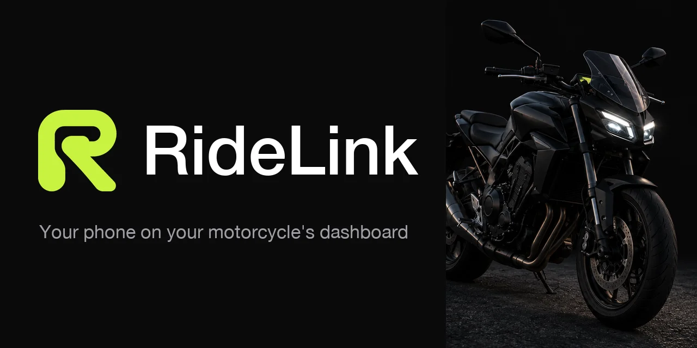

<div align="center">



# RideLink

**Your phone on your motorcycle's dashboard.**

</div>

RideLink puts **Android Auto**, **screen mirroring** and **handlebar controls** on your motorcycle's TFT, over the dashboard's own Wi-Fi. It talks to the EasyConn / Carbit T-Box dashboards that many brands ship (for example Zontes and CFMOTO).

> [!NOTE]
> RideLink is a **personal fork of [MOTO-HUB](https://github.com/vincenzobpt/MOTO-HUB)** by Vincenzo Buonomano, licensed under the AGPL-3.0. It is **not affiliated** with MOTO-HUB or its author. All credit for the protocol work, the T-Box transport and the Android Auto receiver goes upstream.

> [!WARNING]
> Experimental software for personally owned hardware. Set everything up while parked, plan your route before riding, and use it at your own risk.

## What it does

- **Android Auto on the TFT**, through an embedded local head-unit receiver, with per-bike `FIT` / `STRETCH` / `CROP` layout and safe margins.
- **Screen mirroring**: the whole phone or a single app, streamed to the dashboard.
- **Handlebar buttons**: a guided calibration learns what your bike sends, then maps press / double press / hold to Android Auto actions, volume or the assistant.
- **Garage**: several motorcycles, paired by scanning the QR code on the dashboard.
- **USB external display** (AOA), independent of the T-Box.

Android 12 or newer.

## Build

Requirements: Android Studio's bundled JDK (JBR), Android SDK 36, and a physical phone (an emulator cannot do the motorcycle Wi-Fi or Android Auto). The prebuilt `hudlib.aar` transport is already in `apps/android/app/libs/`.

```bash
export JAVA_HOME="/Applications/Android Studio.app/Contents/jbr/Contents/Home"
export ANDROID_HOME="$HOME/Library/Android/sdk"
cd apps/android && ./gradlew :app:installDebug
```

### Android Auto identity

Android Auto needs a head-unit identity. RideLink uses the public one from the open-source [open-headunit](https://github.com/andreknieriem/open-headunit) project (AGPL): its `cert` goes in `tooling/private/android-auto/aa_cert` and its `privkey`, without the PEM header and footer lines, in `tooling/private/android-auto/aa_identity_data`. From the repository root:

```bash
R=repos/andreknieriem/open-headunit/contents/app/src/main/res/raw; mkdir -p tooling/private/android-auto; gh api $R/cert --jq .content | base64 -d > tooling/private/android-auto/aa_cert; gh api $R/privkey --jq .content | base64 -d | grep -v '^-----' > tooling/private/android-auto/aa_identity_data
```

`tooling/private/` is gitignored, and `includeAndroidAutoIdentity=true` is already set in `apps/android/gradle.properties`, so the next build picks the files up. Without them the app still builds and works; Android Auto just stays off.

On the phone, Android Auto must accept a head unit it does not know: open **Android Auto ▸ Version** (tap it ten times for Developer settings), enable **Unknown sources** (newer wording: *Add new cars to Android Auto*), then choose **Start head unit server** from the **⋮** menu. The app walks you through this under `Settings ▸ Android Auto does not start`.

## Documentation

Architecture, the T-Box streaming contract, security notes and the design system are in [`documentation/`](documentation/).

## License

RideLink, like MOTO-HUB, is licensed under the **GNU Affero General Public License v3.0** — see [`LICENSE`](LICENSE) and [`NOTICE`](NOTICE). The repository combines GPL-3.0 material (`hudlib.aar`, the T-Box transport, built from [ridedaemon-lib](https://github.com/vincenzobpt/ridedaemon-lib)) with AGPL-3.0-derived material (the Android Auto receiver); AGPL-3.0 covers both. If you distribute a build, the corresponding source must stay available to its users.

CFMOTO, Zontes, EasyConn, Carbit, Android Auto, Google and related names belong to their respective owners. RideLink is an independent project and does not imply support from any of them.
